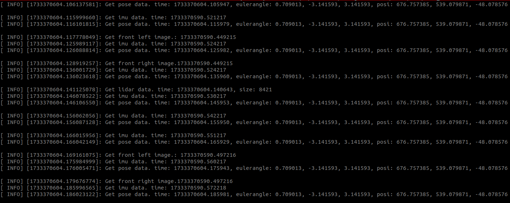

# __自主无人机竞速基本开发教程__  
## 1. 启动模拟器 
参考 ***https://github.com/RoboMaster/IntelligentUAVChampionshipSimulator*** 配置好模拟器并启动

## 2. 安装Nvidia-Docker
>确保已安装了 Nvidia 驱动
----
>安装docker
>+ `sudo apt-get install ca-certificates gnupg lsb-release`
>+ `sudo mkdir -p /etc/apt/keyrings`
>+ `curl -fsSL https://download.docker.com/linux/ubuntu/gpg | sudo gpg --dearmor -o /etc/apt/keyrings/docker.gpg`
>+ `echo "deb [arch=$(dpkg --print-architecture) signed-by=/etc/apt/keyrings/docker.gpg] https://download.docker.com/linux/ubuntu $(lsb_release -cs) stable" | sudo tee /etc/apt/sources.list.d/docker.list > /dev/null`
>+ `sudo apt-get update`
>+ `sudo apt-get install docker-ce docker-ce-cli containerd.io docker-compose-plugin`
----
>安装nvidia-container-toolkit
>+ `distribution=$(. /etc/os-release;echo $ID$VERSION_ID)`
>+ `curl -s -L https://nvidia.github.io/nvidia-docker/gpgkey | sudo apt-key add -`
>+ `curl -s -L https://nvidia.github.io/nvidia-docker/$distribution/nvidia-docker.list | sudo tee /etc/apt/sources.list.d/nvidia-docker.list`
>+ `sudo apt-get update && sudo apt-get install -y nvidia-container-toolkit`
>+ `sudo systemctl restart docker`
---
>设置用户组，消除 *sudo* 限制  
>+ `sudo groupadd docker`  
>+ `sudo gpasswd -a $USER docker`  
>+ 注销账户并重新登录使新的用户组生效
>+ sudo service docker restart

## 3. 安装ROS-Noetic 
>+ `sudo sh -c 'echo "deb http://packages.ros.org/ros/ubuntu $(lsb_release -sc) main" > /etc/apt/sources.list.d/ros-latest.list'`   
>+ `sudo apt install curl `  
>+ `curl -s https://raw.githubusercontent.com/ros/rosdistro/master/ros.asc | sudo apt-key add -`   
>+ `sudo apt update`
>+ `sudo apt install ros-noetic-desktop-full`
>+ `sudo apt install python3-catkin-tools`

## 4. 基于docker镜像的控制程序开发流程
本次比赛中的模拟器使用 ***ROS*** 进行通讯，选手需要编写含有控制程序的ros功能包操控无人机完成目标,该ros功能包需要封装在docker镜像中进行提交。建议先在主机下开发完相应程序后在进行程序的docker封装，流程如下
>进入文件目录  
`cd /path/to/IntelligentUAVChampionshipBase/basic_dev`  
>开发案例完成功能设计与程序开发并根据需要修改 _Dockerfile_ 后，构建镜像   
`docker build -t basic_dev .`      
>导出镜像  
`docker image save [镜像：TAG] > test.tar`    
在主机工作目录下会出现 test.tar 文件，该文件即为可提交镜像  
### 注意:  
1. 服务器会在外部随机分配ip给容器，不能在镜像中的启动文件中提供 *ROS_IP* 和 *ROS_MASTER_URI* 这两个环境变量，否则服务器与容器将无法连接     
2. 镜像中的程序应在镜像启动后自动开启    
3. 镜像程序不允许使用GUI(X11等)功能        

## 5. 程序案例
### 基础开发环境(basic_dev)
#### 简介
该镜像包含有ros-noetic-desktop-focal以及相关的必要ros组件。程序中展示了如何模拟器进行数据交互
#### 使用说明
>进入文件目录    
`cd /path/to/IntelligentUAVChampionshipBase/basic_dev`  
>构建镜像   
`docker build -t basic_dev .`  
>启动docker镜像   
`./run_basic_dev.sh`  
>当看到如下图，说明容器启动成功，程序可接受到模拟器传出的数据

## ros数据交互  
>用于获取数据的可订阅的主题  
>+ 前视相机   
`/airsim_node/drone_1/front_left/Scene`  
`/airsim_node/drone_1/front_right/Scene`
>+ 后视相机  
`/airsim_node/drone_1/back_left/Scene`  
`/airsim_node/drone_1/back_right/Scene`  
>+ imu数据  
`/airsim_node/drone_1/imu/imu`
>+ 雷达数据  
`/airsim_node/drone_1/lidar`
>+ 无人机状态真值  
`/airsim_node/drone_1/debug/pose_gt`  
>+ gps数据(含带误差姿态)  
`/airsim_node/drone_1/gps`  
>+ 电机输入PWM信号(0:右前, 1:左后, 2:左前, 3:右后)  
`/airsim_node/drone_1/debug/rotor_pwm`  
>+ 起始位姿  
`/airsim_node/initial_pose`  
>+ 终点位置  
`/airsim_node/end_goal`  
---- 
>用于发送指令的主题
>+ 速度控制  
`/airsim_node/drone_1/vel_cmd_body_frame`
>+ PWM控制(0:右前, 1:左后, 2:左前, 3:右后)  
`/airsim_node/drone_1/rotor_pwm_cmd`
----
>可用服务   
>+ 起飞   
`/airsim_node/drone_1/takeoff`   
>+ 降落   
`/airsim_node/drone_1/land`   
>+ 重置   
`/airsim_node/reset` 
### 注意:   
服务器仅开放规则手册中提及的话题,其余话题仅供调试程序使用。

## 系统相关参数
> 无人机系统参数  
>+ 质量 0.9kg    
>+ 轴距（电机至机体中心）0.18米  
>+ 转动惯量 Ixx 0.0046890742, Iyy 0.0069312, Izz 0.010421166  
>+ 电机升力系数 0.000367717  
>+ 电机反扭力系数 4.888486266072161e-06  
>+ 最大转速 11079.03 转每分钟  
----
> 标定板参数
>+ 行数（内点）8  
>+ 列数（内点）11  
>+ 方块边长 0.06 米  

