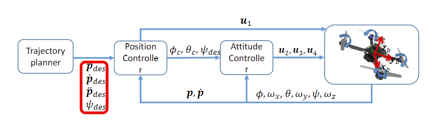
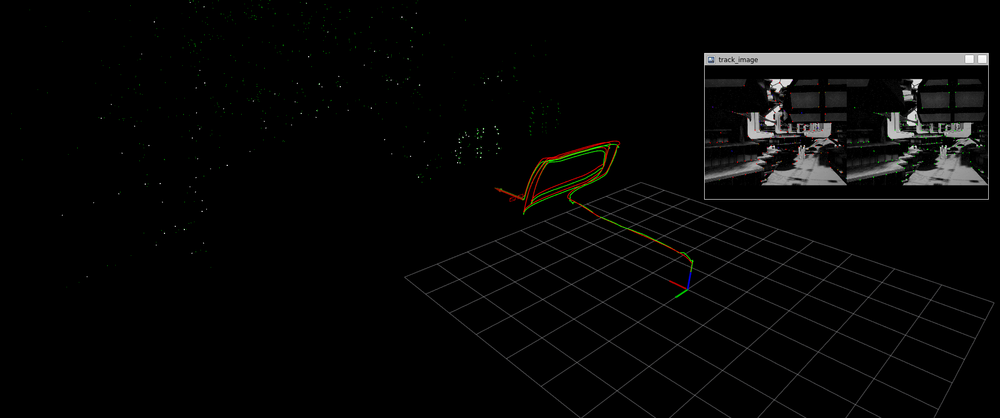
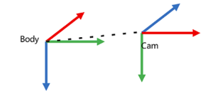
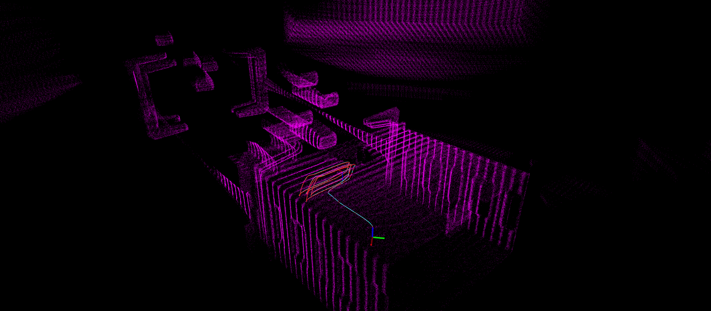

# RMUA挑战赛

## pxx

[microsoft/AirSim: Open source simulator for autonomous vehicles built on Unreal Engine / Unity, from Microsoft AI & Research](https://github.com/microsoft/AirSim)

[microsoft.com/en-us/research/wp-content/uploads/2017/02/aerial-informatics-robotics.pdf](https://www.microsoft.com/en-us/research/wp-content/uploads/2017/02/aerial-informatics-robotics.pdf)

[Home - AirSim](https://microsoft.github.io/AirSim/)

* [x] 旋翼无人机控制器
	```bash
   cd WORKSPACE_NAME/src
   git clone git@github.com:ethz-asl/mav_comm.git
   
   cd WORKSPACE_NAME
   catkin_make -DCMAKE_BUILD_TYPE=Release -DCMAKE_EXPORT_COMPILE_COMMANDS=Yes 
   
   source ./devel/setup.sh
	roslaunch rotors_control rmua_control_test.launch
	```
* [ ] EKF传感器融合
* [x] 发布消息控制无人机（键盘操控，以方便后面测试）

  ```bash
  rosrun remote_control teleop_twist_node
  ```

  w/s z轴升降， a/d 航向角，上/下 x轴移动，左/右 y轴移动

* [x] imu内参标定

* [x] Point_LIO移植

  ```bash
  # 需要安装Livox-SDK livox_ros_driver
  roslaunch point_lio mapping_rmua.launch
  ```

* [x] VINS_Fusion移植

  里面添加了basic_dev节点，作用是将无人机真实位姿（geometry_msgs::PoseStamped）转化为路径（nav_msgs::Path）通过rviz可视化查看

  ```bash
  # 需要安装ceres_solver
  roslaunch vins rmua.launch
  ```
* [ ] 双目RGB -> 深度图
### 旋翼无人机控制器

#### se3 控制器


[How to convert rotor velocity to PWM and constant units · Issue #2592 · microsoft/AirSim](https://github.com/microsoft/AirSim/issues/2592)

[AirSim(16) - 合力、合力矩到电机控制的转换(2022.3.18写) - 知乎](https://zhuanlan.zhihu.com/p/483137491)

$$
F_i=C_T\omega_{max}^2u_i \\
\tau_i=C_{Q}\omega_{max}^2u_i.
$$


```matlab
clc;

% 常量定义
d = 0.18;                   % 轴距 (m)
m = 0.9;                    % 质量 (kg)
max_rpm = 11079.03;         % 旋翼最大转速 (r/min)
c_t = 0.000367717;          % 升力系数 (N·s^2/m^2)
c_q = 4.888486266072161e-06; % 反扭力系数 (N·m·s^2/rpm^2)
I = diag([0.0046890742, 0.0069312, 0.010421166]); % 转动惯量 (kg·m^2)

g = 9.81;                   % 重力加速度 (m/s^2)

% 转速换算
max_rps = max_rpm / 60;     % 最大转速 (r/s)
max_rad = max_rps * 2 * pi; % 最大角速度 (rad/s)

% 悬停时的电机转速（归一化值）
pwm = 0.17806102335453033; % 悬停时电机转速归一化值

% 计算推力
trust = pwm * max_rps^2 * c_t * 4; % 总推力 (N)

% 输出结果
fprintf('总推力: %.2f N\n', trust);
```

    
#### px4ctrl

[控制器图解 | PX4 Guide (main)](https://docs.px4.io/main/zh/flight_stack/controller_diagrams.html)

[Offboard 模式 | PX4 Guide (main)](https://docs.px4.io/main/zh/flight_modes/offboard)

[利用视觉或运动捕捉系统进行位置估计 | PX4 Guide (main)](https://docs.px4.io/main/zh/ros/external_position_estimation.html)



**(1) px4ctrl 作为外环控制器**

- `px4ctrl` 通常作为一个高层次控制器（外环位置控制器），计算较高级的控制目标（位置 -> 速度）。
- PX4 固件中的控制器（内环姿态控制器）继续负责底层控制任务（角速度、姿态控制）。
- 这种模式下，`px4ctrl` 会通过通信协议（如 MAVLink 或 ROS）向 PX4 固件发送期望的目标值，例如期望的速度或位置。

**(2) px4ctrl 完全接管控制**

- `px4ctrl` 可以直接生成底层控制指令（如电机速度或姿态），绕过 PX4 固件中的控制器。
- 在这种模式下，PX4 固件的内环控制器会被停用或不参与控制。

#### EKF状态估计器

[无人机 PX4 飞控 | EKF 使用传感器汇总与添加传感器方法_px4 ekf-CSDN博客](https://blog.csdn.net/qq_32761549/article/details/141218627)

[PX4飞控中利用EKF估计姿态角代码详解-CSDN博客](https://blog.csdn.net/lizilpl/article/details/45542907)

### 键盘控制节点

[AirSim无人机键盘控制-CSDN博客](https://blog.csdn.net/lihuanl/article/details/122802219)

1. 速度控制消息

   ```bash
   rostopic pub /airsim_node/drone_1/vel_cmd_body_frame airsim_ros/VelCmd "twist:
     linear:
       x: 0
       y: 0
       z: 0
     angular:
       x: 0
       y: 0
       z: 0"
   ```

### SLAM

#### VINS_Fusion

> 1. IMU 频率只有100Hz
>
>    ```bash
>    $ rostopic hz /airsim_node/drone_1/imu/imu
>    subscribed to [/airsim_node/drone_1/imu/imu]
>    average rate: 99.962
>            min: 0.010s max: 0.011s std dev: 0.00025s window: 100
>    average rate: 99.987
>            min: 0.009s max: 0.011s std dev: 0.00025s window: 200
>    ```
>
> 2. 相机曝光过低，导致大量的黑色区域，图像特征提取困难
>
> 

以左前方相机为例，根据``setting.json`:

```json
    "front_left":{
       "CaptureSettings":[
          {
             "ImageType":0,
             "Width": 960,
             "Height":720,
             "FOV_Degrees":60,
             "TargetGamma":1
          }
       ],
       "X": 0.175,
    "Y": -0.15,
    "Z": 0,
       "Pitch":0,
       "Roll":0,
       "Yaw":0
    },
```

##### **相机内参**

1. **焦距（`f_x`, `f_y`）**
   $$
   f_x = f_y = \frac{\text{Width}}{2 \cdot \tan\left(\frac{\text{FOV}}{2}\right)}
   $$
   
2. **主点（`c_x`, `c_y`）**
     $$
     c_x = \frac{\text{Width}}{2}, \quad c_y = \frac{\text{Height}}{2}
     $$
     
3. **内参矩阵 $K$**

$$
K = 
     \begin{bmatrix}
     f_x & 0 & c_x \\
     0 & f_y & c_y \\
     0 & 0 & 1
     \end{bmatrix}
$$

​	

```yaml
projection_parameters:
   fx: 831.3843876
   fy: 831.3843876
   cx: 480.0
   cy: 360.0
```

  4. **畸变参数**

     在 AirSim 的配置文件中，畸变参数通常是通过 `NoiseSettings` 中的具体配置项来模拟相机噪声和失真效果的。然而，这些参数并不直接对应于传统相机模型中的径向和切向畸变参数（如 `k1, k2, k3` 和 `p1, p2`）。

##### **相机外参**



```yaml
body_T_cam0: !!opencv-matrix
   rows: 4
   cols: 4
   dt: d
   data: [0.0, 0.0, 1.0, 0.175,
          1.0, 0.0, 0.0, -0.15,
          0.0, 1.0, 0.0, 0.0,
          0.0, 0.0, 0.0, 1.0]
```

##### IMU内参

[IMU噪声模型与标定：理论与实践-CSDN博客](https://blog.csdn.net/weixin_42681311/article/details/126109617)

```yaml
%YAML:1.0
---
type: IMU
name: airsim
Gyr:
   unit: " rad/s"
   avg-axis:
      gyr_n: 1.7740269167702946e-03
      gyr_w: 1.3782706867714904e-05
   x-axis:
      gyr_n: 1.7527648456287569e-03
      gyr_w: 1.2749944270619166e-05
   y-axis:
      gyr_n: 1.7814803131937006e-03
      gyr_w: 1.4324135736079974e-05
   z-axis:
      gyr_n: 1.7878355914884259e-03
      gyr_w: 1.4274040596445567e-05
Acc:
   unit: " m/s^2"
   avg-axis:
      acc_n: 4.7947667093816371e-02
      acc_w: 2.8562889763953406e-04
   x-axis:
      acc_n: 4.7017608683122596e-02
      acc_w: 2.0657015214584510e-04
   y-axis:
      acc_n: 4.8597221140189273e-02
      acc_w: 3.2225042410795573e-04
   z-axis:
      acc_n: 4.8228171458137237e-02
      acc_w: 3.2806611666480126e-04
```


#### Point_LIO

[hku-mars/Point-LIO](https://github.com/hku-mars/Point-LIO)



```json
"lidar": {
    "SensorType": 6,                 // 传感器类型。6 代表激光雷达传感器。
    "Enabled": true,                 // 是否启用激光雷达。设置为 true 启用传感器，false 则禁用。
    "NumberOfChannels": 32,          // 激光雷达的通道数，表示激光雷达发射激光束的数量。
    "RotationsPerSecond": 10,        // 激光雷达每秒旋转的次数。10 代表每秒旋转 10 次。
    "PointsPerSecond": 200000,       // 激光雷达每秒生成的点云数量。200,000 点每秒表示高密度的点云数据。
    "X": 0,                          // 激光雷达传感器在 X 轴上的位置偏移。
    "Y": 0,                          // 激光雷达传感器在 Y 轴上的位置偏移。
    "Z": -0.05,                      // 激光雷达传感器在 Z 轴上的位置偏移。
    "Roll": 0,                       // 激光雷达传感器绕 X 轴的旋转角度（滚转角度）。
    "Pitch": 0,                      // 激光雷达传感器绕 Y 轴的旋转角度（俯仰角度）。
    "Yaw": 0,                        // 激光雷达传感器绕 Z 轴的旋转角度（偏航角度）。
    "VerticalFOVUpper": 52,          // 激光雷达的垂直视场角上限。单位是度，表示激光雷达的上视角度范围（从水平面向上）。
    "VerticalFOVLower": -7,          // 激光雷达的垂直视场角下限。单位是度，表示激光雷达的下视角度范围（从水平面向下）。
    "HorizontalFOVStart": -180,      // 激光雷达的水平视场角起始位置。单位是度，-180 表示从地面左侧开始。
    "HorizontalFOVEnd": 180,         // 激光雷达的水平视场角结束位置。单位是度，180 表示地面右侧。
    "DrawDebugPoints": false,        // 是否在调试模式下绘制激光雷达的点云数据。设置为 true 会在模拟界面中显示点云。
    "DataFrame": "SensorLocalFrame", // 数据坐标系的参考框架。一般为 "SensorLocalFrame"，表示以传感器坐标系为参考。
    "Range": 30                      // 激光雷达的最大测量范围。单位是米，30 表示激光雷达的最大有效探测距离为 30 米。
}
```

```bash
Failed to find match for field 't'.
Failed to find match for field 'reflectivity'.
Failed to find match for field 'ring'.
Failed to find match for field 'ambient'.
Failed to find match for field 'range'.
Failed to find match for field 'intensity'.
```

`point_lio`包的设计目标之一是实现高频率的里程计发布，通常能够达到4kHz到8kHz的频率。Airsim仿真环境中LiDAR传感器的一帧数据包中的激光点扫描时间是一致的，即所有激光点的时间戳是相同的。这种行为虽然在某些情况下是合理的，但在高频率更新的系统中，实际上不应如此。现实环境中，每个激光点的扫描时间应有所不同，以反映出激光雷达传感器在扫描过程中可能发生的微小时间偏差。由于这一时间一致性，`point_lio`中的里程计更新频率被迫受到限制，无法达到预计的高频率。
